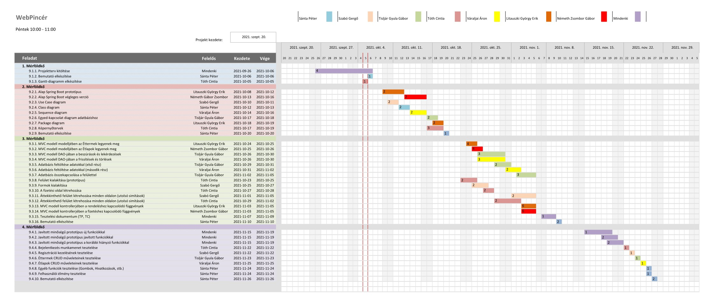

# WebPincér Projektterv 2021

## 1. Összefoglaló 

A WebPincér hivatása, hogy a felhasználok a lehető legjobb ár/érték kategóriában találhassanak különféle kategóriájú étkezőhelyeket. 
A házhoz szállítás mellett több más szolgáltatást is fog nyújtani a látogatóknak az oldal, pl. elvitelre rendelést vagy a legjobb étterem kiválasztást is segíti.
Számos, hagyományos étterem is megtalálható lesz az adatbázisban. 
Lehetőséget nyújtunk érintkezésmentes kiszállításra is. Ezeket a funkciókat egy igényes, szép oldalról, éjjel nappal használhatják majd a felhasználók, 
aminek használata gyors és egyszerű lesz.

## 2. Verziók

| Verzió | Szerző(k)                | Dátum        | Státusz         | Megjegyzés                                                    |
|--------|--------------------------|--------------|-----------------|---------------------------------------------------------------|
| 0.1  | Sánta Péter, Szabó Gergő, Tóth Cintia, Váraljai Áron, Németh Zsombor| 2021-09-26 | Elfogadott    | Projektterv, Gantt-diagramm (tervezés)|
| 0.2   | Szabó Gergő   | 2021-10-01 | Elfogadott | Projektterv (folytatás)
| 0.3   | Mindenki   | 2021-10-04 | Elfogadott | Projektterv (befejezés)
| 0.4   | Szabó Gergő, Tóth Cintia   | 2021-10-05 | Elfogadott | Gantt-diagramm befejezés
| 0.5   | Mindenki | 2021-10-21 | Elfogadott | Tervezési diagrammok (Class, Package, Sequence, UseCase, Képernyőtervek)
| 1.0   | Mindenki | 2021-11-11 | Elfogadott | Prototípus
| 1.1   | Mindenki | 2021-12-02 | Elfogadott | Prototípus + Session kezelés, adminfunkciók bővítése, bugfixek, hiányzó kényelmi funkciók

Státusz osztályozás:
 - Tervezet: befejezetlen dokumentum, a mérföldkő leadása előtti napokban
 - Előterjesztés: a projekt menedzser bírálatával, a mérföldkő határidejekor
 - Elfogadott: a megrendelő által elfogadva, a prezentáció bemutatásakor

## 3. A projekt bemutatása

A projektterv a WebPincér projektet mutatja be, melyen 2021 szeptember 22-től, 2021 december 3-ig dolgozunk heten: Sánta Péter, Szabó Gergő, Tisljár Gyula Gábor,
Németh Zsombor Gábor, Litauszki György Erik, Váraljai Áron, Tóth Cintia. 
A projekten hét fő fejlesztő fog dolgozni, minden nagyobb területen 2-2 ember lesz, az elvégzett feladatokat pedig négy alkalommal fogjuk prezentálni a megrendelőnek.

### 3.1. Rendszerspecifikáció

A rendszernek képesnek kell lennie megjeleníteni különböző éttermeket. Az éttermeket kategorizálni kell népszerűség, ár és minőség szerint. Az éttermeknek a teljes étlapjához hozzáférést kell biztosítani, arról szabadon lehessen rendelni (például különböző ételeket, különböző feltétekkel, alapokkal, stb). A választott termékeket tudni kell megrendelni, biztosítani felületet a házhoz szállításhoz és az elviteles lehetőségekhez is. Elégséges a készpénzes fizetést támogatnia.
A rendszerre nagy az igény, mert napjainkban rengeteg különböző étkezőhelyből lehet választani, kell egy hely ahol ezeket rendszerezik, összeszedik, és ahonnan egységesen lehet rendelni, egyszerűen és gyorsan. A felhasználókról el tudjunk menteni adatokat, hogy ne kelljen újra beírnia következő rendeléskor.

### 3.2. Funkcionális követelmények

 - Felhasználói munkamenet megvalósítása több jogosultsági szinttel (admin, user)
 - Felhasználók kezelése (CRUD)
 - Éttermek kezelése (CRUD)
 - Éttermek termékeinek kezelése (CRUD)
 - Kosár megvalósítása
 - Fizetés megvalósítása a kosárban lévő termékekhez
 

### 3.3. Nem funkcionális követelmények

 - Interaktív oldal
 - Reszponzív oldal
 - A személyes adatokat védve tároljuk
 - Gyors működés

## 4. Költség- és erőforrás-szükségletek

Az erőforrásigényünk összesen kb. 22 személynap/fő.

A rendelkezésünkre áll összesen 7 * 70 = 490 pont.

## 5. Szervezeti felépítés és felelősségmegosztás
A projekt megrendelője Márkus András. A WebPincér projektet a projektcsapat fogja végrehajtani, amely jelenleg 7 fejlesztőből áll. A csapatban található tapasztalt és pályakezdő frontendes is, illetve backend programozó is. A tapasztaltabb projekttagok fél-1 éve dolgoznak az iparban, illetve van egy, aki már 4 hónapja.
 - Sánta Péter (1 év tapasztalat)
 - Szabó Gergő (7 hónap tapasztalat)
 - Tóth Cintia (4 hónap tapasztalat)
 - Tisljár Gyula Gábor (pályakezdő)
 - Németh Zsombor Gábor (pályakezdő)
 - Litauszki György Erik (pályakezdő)
 - Váraljai Áron (pályakezdő)
 
 Sánta Péter: Az RGAI egy kutatója. Fő kompetenciái: Python, Gépi Tanulás, Java. Gépi Tanuláson belül NLP-vel foglalkozott eddig az RGAI projektjén belül. Ezen kívül egy Javaban írt nyelvi elemző szoftveren végzett módosításokat, illetve segédkezett frontend területen a React keretrendszer használatával. Alap szinten ismeri a Flask szerver használatát, illetve szoftverek kommunikációjának lebonyolítását REST segítségével. 

 Szabó Gergő: Az RGAI tanszéken volt kutató, itt töltötte a szakmai gyakorlatát, illetve folytatta még a kutatását mostanáig. Főbb feladatai (backend) egy nyelvi elemző szoftver fejlesztése volt. (Spacy, NLP, magyarlánc modulok használatával) 

 Tóth Cintia: Jelenleg egy szoftverfejlesztő cégnél eszközfejlesztő (frontend), gyakornoki munkáját júniusban kezdte meg.   

 Tisljár Gyula Gábor: Most fogok elkezdeni dolgozni (ha minden jól meg az RGAI-nál), de igazából mindent szeretek, ami nem webes.  

 Németh Zsombor Gábor: Jelenleg nem dolgozik semmit, Java-t kedvelem, Javascriptet nem annyira.  

 Litauszki György Erik: Jelenleg nem dolgozik semmit, Java-ban komfortosan dolgozik, Javascriptel is boldogul ha muszáj.  

 Váraljai Áron: Jelenleg nem dolgozom, közel minden nyelvet szeretek.  

### 5.1 Projektcsapat
A projekt a következő emberekből áll:

|                                                                                                                   | Név                   | E-mail cím (stud-os)       |
|-------------------------------------------------------------------------------------------------------------------|-----------------------|----------------------------|
| Megrendelő                                                                                                        | Márkus András         | markusa@inf.u-szeged.hu   |
| Felelősségek: Projekt menedzser, Dokumentáció, Prezentációk                                                      | Sánta Péter           | h985635@stud.u-szeged.hu |
| Felelősségek: Frontend, Dokumentáció, Prezentációk                                                              | Szabó Gergő           | h985332@stud.u-szeged.hu |
| Felelősségek: Frontend, Képernyőtervek                                                                      | Tóth Cintia           | h985809@stud.u-szeged.hu |
| Felelősségek: Adatbázis és adatkapcsolatok, UML                                                                   | Tisljár Gyula Gábor         | h985743@stud.u-szeged.hu |
| Felelősségek: Adatbázis és adatkapcsolatok, UML                                                                   | Váraljai Áron         | h986133@stud.u-szeged.hu |
| Felelősségek: Java (Backend)                                                                                             | Litauszki György Erik | h984115@stud.u-szeged.hu |
| Felelősségek: Java (Backend)                                                                                          | Németh Zsombor Gábor  | h984684@stud.u-szeged.hu |

## 6. A munka feltételei

### 6.1. Munkakörnyezet
A projekt a következő munkaállomásokat fogja használni a munka során:
 - Munkaállomások: 7 db PC Windows 10/11/-es operációs rendszerrel
 - Dell G5 15 laptop (CPU: Intel(R) Core(TM) i5-8300H, RAM: 16 GB, GPU: NVIDIA GeForce GTX 1050 Ti)
 - Lenovo Legion laptop (CPU: i7 8750H, RAM: 24 GB, GPU: Nvidia GTX 1050 TI)
 - Asus Rog Strix laptop (CPU: i7-6700HQ, RAM: 16 GB, GPU: NVIDIA GeForce GTX 960M)
 - Dell Inspiron 15 laptop (CPU: Intel(R) Core(TM) i5-8250U RAM: 8 GB, GPU: Radeon(TM) 530)
 - ASUS ROG Strix G531GU-AL001 laptop (CPU: I7-9750H, RAM: 16GB, GPU: Nvidia GTX 1660)
 - PC CPU: i5-9400F, RAM: 16GB, GPU: GTX 950
 - PC CPU: Ryzen 7 3700X, RAM 16GB, GPU: Gigabyte RTX 2070 Super

A projekt a következő technológiákat/szoftvereket fogja használni a munka során: 
 - Heroku platformszolgáltatás
 - Heroku által biztosított PostgreSQL adatbázisszerver
 - Spring Boot (backend)
 - Maven szoftverprojekt menedzselő szoftver
 - JetBrains IDE: IntelliJ Idea, WebStorm
 - Git verziókövető (GitLab)

### 6.2. Rizikómenedzsment

| Kockázat                                    | Leírás                                                                                                                                                                                     | Valószínűség | Hatás  |
|---------------------------------------------|--------------------------------------------------------------------------------------------------------------------------------------------------------------------------------------------|--------------|--------|
| Csúszás                        | Nem előre látható bugok miatt előfordulhat csúszás az előre kiszabott dátumokig, de nem a mérföldkőig. Megoldás: Folyamatos kommunikáció (SCRUM)      | közepes    | közepes |
| Esetleges zárlat a covid miatt | A csapattagok között rossz az információ áramlás, nem pontosan, esetleg késve vagy nem egyértelműen tájékoztatjuk egymást. Megoldás: Több online meeting | nagy     | erős |
| Betegség | A csapattagok teljesítménye csökken, a projektre fordított idő csökken. | közepes | gyenge

## 7. Jelentések

### 7.1. Munka menedzsment
A munkát Sánta Péter koordinálja. Fő feladata, hogy a meetingeket megszervezze, a bemutatókat megcsinálja, a csapatnak minden téren segítsen amennyiben elakad (Java, adatbázis, frontend), a csapattagoknak kiszabja a feladatokat és azokat felügyelje, a határidőket betartassa. Kritikus döntések meghozása (például a használt folyamatmodell, vagy a rendszer pontos specifikációi). Ezt Messengeren és Discordon való rendszeres kommunikálással hajtja végre, rendszeres rövid (15 perces) online meetingekkel, illetve esetleges nagyobb, hibrid (akik meg tudnak jelenni élőben, azok élőben jelennek meg, akik nem, azok online) meetingekkel.

### 7.2. Csoportgyűlések

A csapat hetente kétszer ülésezik, 2*15 percet, ahol megvitatják az eddigi haladást, és a jövőre szóló terveket. Ezen kívül alkalmi nagyobb meetingek is lesznek. 

1.  megbeszélés:
 - Időpont: 2021.09.22.
 - Hely: Petiék Lakása és Online - Szeged
 - Résztvevők: Sánta Péter, Szabó Gergő, Tóth Cintia, Tisljár Gyula Gábor, Váraljai Áron, Németh Zsombor Gábor, Litauszki György Erik
 - Érintett témák: GIT kiselőadás

2. megbeszélés:
 - Időpont: 2021.09.26.
 - Hely: Petiék Lakása és Online - Szeged
 - Résztvevők: Sánta Péter, Szabó Gergő, Tóth Cintia, Tisljár Gyula Gábor, Váraljai Áron, Németh Zsombor Gábor
 - Érintett témák: Projektterv elkezdése, részfeladatok kiosztása

3. megbeszélés:
 - Időpont: 2021.10.04.
 - Hely: Petiék Lakása és Online - Szeged
 - Résztvevők: Sánta Péter, Szabó Gergő, Tóth Cintia, Tisljár Gyula Gábor, Váraljai Áron, Németh Zsombor Gábor
 - Érintett témák: Projektterv befejezése

 3. megbeszélés:
 - Időpont: 2021.10.15.
 - Hely: Petiék Lakása és Online - Szeged
 - Résztvevők: Sánta Péter, Szabó Gergő, Tóth Cintia, Tisljár Gyula Gábor, Váraljai Áron, Németh Zsombor Gábor, Litauszki György Erik
 - Érintett témák: M2 taskok megbeszélése

 4. megbeszélés:
 - Időpont: 2021.10.18.
 - Hely: Petiék Lakása és Online - Szeged
 - Résztvevők: Sánta Péter, Szabó Gergő, Tóth Cintia, Tisljár Gyula Gábor, Váraljai Áron, Németh Zsombor Gábor
 - Érintett témák: M2 taskokkal való haladás megbeszélése

 4. megbeszélés:
 - Időpont: 2021.10.22.
 - Hely: Petiék Lakása és Online - Szeged
 - Résztvevők: Sánta Péter, Tisljár Gyula Gábor, Váraljai Áron, Németh Zsombor Gábor
 - Érintett témák: SCRUM meeting, addigi haladások megbeszélése, tervek megbeszélése

5. megbeszélés:
 - Időpont: 2021.10.25.
 - Hely: Petiék Lakása és Online - Szeged
 -  Résztvevők: Sánta Péter, Szabó Gergő, Tóth Cintia, Tisljár Gyula Gábor, Váraljai Áron, Litauszki György Erik
 - Érintett témák: SCRUM meeting, addigi haladások megbeszélése, tervek megbeszélése

 6. megbeszélés:
 - Időpont: 2021.10.31.
 - Hely: Petiék Lakása és Online - Szeged
 - Résztvevők: Sánta Péter, Szabó Gergő, Tóth Cintia, Tisljár Gyula Gábor, Németh Zsombor Gábor, Litauszki György Erik
 - Érintett témák: Adatbázis előkészítése a projekthez, integrálása, addigi haladások megbeszélése, tervek megbeszélése (nagy meeting + pénteki SCRUM helyettesítése)

 7. megbeszélés:
 - Időpont: 2021.11.05.
 - Hely: Petiék Lakása és Online - Szeged
 - Résztvevők: Sánta Péter, Szabó Gergő, Tóth Cintia, Tisljár Gyula Gábor, Váraljai Áron
 - Érintett témák: SCRUM meeting, addigi haladások megbeszélése, tervek megbeszélése

 8. megbeszélés:
 - Időpont: 2021.11.08.
 - Hely: Petiék Lakása és Online - Szeged
 - Résztvevők: Sánta Péter, Szabó Gergő, Tóth Cintia, Tisljár Gyula Gábor, Váraljai Áron, Németh Zsombor Gábor, Litauszki György Erik
 - Érintett témák: SCRUM meeting, addigi haladások megbeszélése, tervek megbeszélése

 9. megbeszélés:
 - Időpont: 2021.11.15.
 - Hely: Petiék Lakása és Online - Szeged
 -  Résztvevők: Sánta Péter, Szabó Gergő, Tóth Cintia, Váraljai Áron, Litauszki György Erik
 - Érintett témák: SCRUM meeting, addigi haladások megbeszélése, tervek megbeszélése

 10. megbeszélés:
 - Időpont: 2021.11.19.
 - Hely: Petiék Lakása és Online - Szeged
 -  Résztvevők: Sánta Péter, Szabó Gergő, Tóth Cintia, Tisljár Gyula Gábor
 - Érintett témák: SCRUM meeting, addigi haladások megbeszélése, tervek megbeszélése

 11. megbeszélés:
 - Időpont: 2021.11.22.
 - Hely: Petiék Lakása és Online - Szeged
 - Résztvevők: Sánta Péter, Szabó Gergő, Tóth Cintia, Tisljár Gyula Gábor, Váraljai Áron, Németh Zsombor Gábor, Litauszki György Erik
 - Érintett témák: SCRUM meeting, addigi haladások megbeszélése, tervek megbeszélése

 12. megbeszélés:
 - Időpont: 2021.11.25.
 - Hely: Petiék Lakása és Online - Szeged
 - Résztvevők: Sánta Péter, Szabó Gergő, Tóth Cintia, Tisljár Gyula Gábor
 - Érintett témák: SCRUM meeting, addigi haladások megbeszélése, tervek megbeszélése

 13. megbeszélés:
 - Időpont: 2021.11.29.
 - Hely: Petiék Lakása és Online - Szeged
 - Résztvevők: Sánta Péter, Szabó Gergő, Tóth Cintia, Tisljár Gyula Gábor, Váraljai Áron, Németh Zsombor Gábor, Litauszki György Erik
 - Érintett témák: SCRUM meeting, eddigi haladások megerősítése, szerdáig bezárólag (soft deadline az egész projektre) a maradék taskok szétosztása

### 7.3. Minőségbiztosítás

Az elkészült terveket a terveken nem dolgozó csapattársak közül átnézik, hogy megfelel-e a specifikációnak és az egyes diagramtípusok összhangban vannak-e egymással. A meglévő rendszerünk helyes működését a prototípusok bemutatása előtt a tesztelési dokumentumban leírtak végrehajtása alapján ellenőrizzük és összevetjük a specifikációval, hogy az elvárt eredményt kapjuk-e. További tesztelési lehetőségek: unit tesztek írása az egyes modulokhoz vagy a kód közös átnézése (code review) egy, a vizsgált modul programozásában nem résztvevő csapattaggal. Szoftverünk minőségét a végső leadás előtt javítani kell a rendszerünkre lefuttatott kódelemzés során kapott metrikaértékek és szabálysértések figyelembevételével.
Az alábbi lehetőségek vannak a szoftver megfelelő minőségének biztosítására:

- Specifikáció és tervek átnézése (kötelező)
- Teszttervek végrehajtása (kötelező)
- Unit tesztek írása (választható)
- Kód átnézése (választható)

### 7.4. Átadás, eredmények elfogadása

A projekt eredményeit Márkus András fogja elfogadni. A projektterven változásokat csak Márkus András írásos kérés esetén Márkus András engedélyével lehet tenni. A projekt eredményesnek bizonyul, ha specifikáció helyes és határidőn belül készül el. Az esetleges késések pontlevonást eredményeznek.
Az elfogadás feltételeire és beadás formájára vonatkozó részletes leírás a következő honlapon olvasható: https://okt.sed.hu/rf1/

### 7.5. Státuszjelentés

Minden leadásnál a projektmenedzser jelentést tesz a projekt haladásáról, és ha szükséges változásokat indítványoz a projektterven. Ezen kívül a megrendelő felszólítására a menedzser 3 munkanapon belül köteles leadni a jelentést. A gyakorlatvezetővel folytatott csapatmegbeszéléseken a megadott sablon alapján emlékeztetőt készít a csapat, amit a következő megbeszélésen áttekintenek és felmérik az eredményeket és teendőket. Továbbá gazdálkodnak az erőforrásokkal és szükség esetén a megrendelővel egyeztetnek a projektterv módosításáról.

## 8. A munka tartalma

### 8.1. Tervezett szoftverfolyamat modell és architektúra
A választott folyamatmodellünk az agilis szoftverfejlesztés, a SCRUM-on azonban módosításokat végeztünk. Minden napos 15 perces meetingek helyett csak heti 2x lesz 15 perces meeting, ez a csapat általános időhiányából fakad.  
A szoftver két fő része egy Java és egy TypeScript modul lesz, az előbbi tartalmazza az MVC-t, az utóbbi valósítja meg a frontendet, a kettőt REST köti össze.

### 8.2. Átadandók és határidők
A főbb átadandók és határidők a projekt időtartama alatt a következők:

| Szállítandó |                 Neve                |   Határideje  |
|:-----------:|:-----------------------------------:|:-------------:|
|      D1     |       Projektterv és útmutató       | 2021.10.04  |
|    P1+D2    | UML, DB, képernyőtervek és bemutató | 2021.10.18  |
|    P1+D3    |      Prototípus I. és bemutató      | 2021.11.08  |
|    P2+D4    |      Prototípus II. és bemutató     | 2021.11.29  |

## 9. Feladatlista

A következőkben a tervezett feladatok részletes összefoglalása található.

### 9.1. Projektterv (1. mérföldkő)

Ennek a feladatnak az a célja, hogy megvalósításhoz szükséges lépéseket, az ütemzést és a felelősöket meghatározzuk.

Részfeladatai a következők:

#### 9.1.1. Projektterv kitöltése

Felelős: Mindenki

Tartam:  11 nap

Erőforrásigény:  4 személynap/fő

#### 9.1.2 Gantt-diagram elkészítése

Felelős: Szabó Gergő, Tóth Cintia

Tartam: 1 nap

Erőforrásigény: 1 személynap / fő

#### 9.1.3. Bemutató elkészítése

Felelős: Sánta Péter

Tartam:  1 nap

Erőforrásigény:  1 személynap

### 9.2. UML és adatbázis tervek (2. mérföldkő)

Ennek a feladatnak az a célja, hogy az UML alapján megtervezzük az adatbázist, illetve elkészítsük az oldalhoz a képernyőterveket, ami megalapozza az oldal későbbi kinézetét. Megcsináljuk a Spring Boot alapot is, tanulásnak.

Részfeladatai a következők:

#### 9.2.1. Alap Spring Boot prototípus

Felelős: Litauszki György Erik 

Tartam:  4 nap

Erőforrásigény:  2 személynap

#### 9.2.2. Alap Spring Boot végleges verzió

Felelős: Németh Gábor Zsombor 

Tartam:  4 nap

Erőforrásigény:  2 személynap

#### 9.2.3. Use Case diagram

Felelős: Szabó Gergő

Tartam:  2 nap

Erőforrásigény:  2 személynap

#### 9.2.4. Class diagram

Felelős: Sánta Péter

Tartam:  2 nap

Erőforrásigény:  2 személynap

#### 9.2.5. Sequence diagram

Felelős: Váraljai Áron

Tartam:  3 nap

Erőforrásigény:  2 személynap

#### 9.2.6. Egyed-kapcsolat diagram adatbázishoz

Felelős: Tisljár Gyula Gábor

Tartam:  2 nap

Erőforrásigény:  2 személynap

#### 9.2.7. Package diagram

Felelős: Váraljai Áron

Tartam:  2 nap

Erőforrásigény:  2 személynap

#### 9.2.8. Képernyőtervek

Felelős: Tóth Cintia

Tartam:  3 nap

Erőforrásigény:  2 személynap

#### 9.2.9. Bemutató elkészítése

Felelős: Sánta Péter

Tartam:  1 nap

Erőforrásigény:  1 személynap

### 9.3. Prototípus I. (3. mérföldkő)

Ennek a feladatnak az a célja, hogy egy majdnem kész verzióját adjuk ki a projektnek, effektíven egy prototipusát.

Részfeladatai a következők:

#### 9.3.1.  MVC modell modelljében az Éttermek legyenek meg

Felelős: Litauszki György Erik

Tartam:  2 nap

Erőforrásigény: 4 személynap

#### 9.3.2.  MVC modell modelljében az Étlapok legyenek meg

Felelős: Németh Zsombor Gábor

Tartam:  2 nap

Erőforrásigény: 4 személynap

#### 9.3.3.  MVC modell DAO-jában a beszúrások és lekérdezések

Felelős: Tisljár Gyula Gábor

Tartam:  5 nap

Erőforrásigény:  3 személynap

#### 9.3.4.  MVC modell DAO-jában a frissítések és törlések

Felelős: Váraljai Áron

Tartam:  5 nap

Erőforrásigény:  3 személynap

#### 9.3.5. Adatbázis feltöltése adatokkal (első rész)

Felelős: Tisljár Gyula Gábor

Tartam:  3 nap

Erőforrásigény:  2 személynap

#### 9.3.6. Adatbázis feltöltése adatokkal (második rész)

Felelős: Váraljai Áron

Tartam:  3 nap

Erőforrásigény:  2 személynap

#### 9.3.7. Adatbázis összekapcsolása a felülettel

Felelős:  Tisljár Gyula Gábor

Tartam:  4 nap

Erőforrásigény:  3 személynap

#### 9.3.8. Felület kialakítása (prototípus)

Felelős:  Tóth Cintia

Tartam:  3 nap

Erőforrásigény:  2 személynap

#### 9.3.9. Formok kialakítása 

Felelős:  Szabó Gergő

Tartam:  3 nap

Erőforrásigény:  2 személynap

#### 9.3.10. A fizetési oldal létrehozása

Felelős:  Tóth Cintia

Tartam:  2 nap

Erőforrásigény:  2 személynap

#### 9.3.11. Áttekkinthető felület létrehozása minden oldalon (utolsó simítások) 

Felelős:  Tóth Cintia

Tartam:  5 nap

Erőforrásigény:  2 személynap

#### 9.3.12. Áttekkinthető felület létrehozása minden oldalon (utolsó simítások) 

Felelős:  Szabó Gergő

Tartam:  5 nap

Erőforrásigény:  2 személynap

#### 9.3.13.  MVC modell kontrollerjében a rendeléshez kapcsolódó függvények

Felelős: Litauszki György Erik

Tartam:  3 nap

Erőforrásigény: 6 személynap

#### 9.3.14.  MVC modell kontrollerjében a fizetéshez kapcsolódó függvények
Felelős: Németh Zsombor Gábor

Tartam:  3 nap

Erőforrásigény: 6 személynap

#### 9.3.15. Tesztelési dokumentum (TP, TC)

Felelős: Mindenki

Tartam:  3 nap

Erőforrásigény:  1 személynap/fő

#### 9.3.16. Bemutató elkészítése 

Felelős: Sánta Péter

Tartam:  1 nap

Erőforrásigény:  2 személynap

### 9.4. Prototípus II. (4. mérföldkő)

Ennek a feladatnak az a célja, hogy pótoljunk hiányzó funkciókat. Javítsunk meglévőeket, illetve szükség szerint adjunk hozzá új funkciókat.

Részfeladatai a következők:

#### 9.4.1. Javított minőségű prototípus új funkciókkal

Felelős: Mindenki

Tartam:  5 nap

Erőforrásigény:  1 személynap / fő

#### 9.4.2. Javított minőségű prototípus javított funkciókkal

Felelős: Mindenki

Tartam:  3 nap

Erőforrásigény:  2 személynap / fő

#### 9.4.3. Javított minőségű prototípus a korábbi hiányzó funkciókkal

Felelős: Mindenki

Tartam:  3 nap

Erőforrásigény:  2 személynap / fő

#### 9.4.4. Bejelentkezés munkamenet tesztelése

Felelős: Tóth Cintia

Tartam:  1 nap

Erőforrásigény:  1 személynap

#### 9.4.5. Regisztráció kezelésének tesztelése

Felelős: Szabó Gergő

Tartam:  1 nap

Erőforrásigény:  1 személynap

#### 9.4.6. Éttermek CRUD műveleteinek tesztelése

Felelős: Tisljár Gyula Gábor

Tartam:  1 nap

Erőforrásigény:  1 személynap

#### 9.4.7. Étlapok CRUD műveleteinek tesztelése

Felelős: Váraljai Áron

Tartam:  1 nap

Erőforrásigény:  1 személynap

#### 9.4.8. Egyéb funkciók tesztelése (Gombok, Hivatkozások, stb.)

Felelős: Sánta Péter

Tartam:  1 nap

Erőforrásigény:  1 személynap

#### 9.4.9. Felhasználói élmény tesztelése

Felelős: Sánta Péter

Tartam:  1 nap

Erőforrásigény:  1 személynap

#### 9.4.10. Bemutató elkészítése 

Felelős: Sánta Péter

Tartam:  1 nap

Erőforrásigény:  2 személynap

## 10. Részletes időbeosztás

## 11. Projekt költségvetés

### 11.1. Részletes erőforrásigény (személynap)

|                     Név                    | 1. leadás - Projektterv | 2. leadás - UML és adatbázis | 3. leadás - Prototípus I. | 4. leadás - Prototípus II. | Összesen |
|:------------------------------------------:|:----------------------:|:--------------------------:|:-----------------------:|:------------------------:|:---------:|
|                     Sánta Péter            |           `5`          |             `3`           |           `3`          |            `9`           |     `20`   |
|                     Szabó Gergő            |           `5`          |             `2`            |           `5`          |            `6`           |    `18`   |
|                     Tóth Cintia            |           `5`          |             `2`            |           `7`          |            `6`           |    `20`   |
|                     Tisljár Gyula Gábor    |           `4`          |             `2`            |           `9`          |            `6`           |    `21`   |
|                     Litauszki György Erik  |           `4`          |             `2`            |           `11`          |            `5`           |    `22`   |
|                     Németh Zsombor Gábor   |           `4`          |             `2`            |           `11`          |            `5`           |    `22`   |
|                     Váraljai Áron          |           `4`          |             `4`            |           `6`          |            `6`           |    `20`   |

### 11.2. Részletes feladatszámok

|                     Név                    | 1. leadás - Projektterv | 2. leadás - UML és adatbázis | 3. leadás - Prototípus I. | 4. leadás - Prototípus II. | Összesen |
|:------------------------------------------:|:----------------------:|:--------------------------:|:-----------------------:|:------------------------:|:---------:|
|                     Sánta Péter            |           `2`          |             `2`           |           `2`          |            `6`           |     `12`   |
|                     Szabó Gergő            |           `2`          |             `1`            |           `3`          |            `4`           |    `10`   |
|                     Tóth Cintia            |           `2`          |             `1`            |           `4`          |            `4`           |    `11`   |
|                     Tisljár Gyula Gábor    |           `1`          |             `1`            |           `4`          |            `4`           |    `10`   |
|                     Litauszki György Erik  |           `1`          |             `1`            |           `3`          |            `3`           |    `8`   |
|                     Németh Zsombor Gábor   |           `1`          |             `1`            |           `3`          |            `3`           |    `8`   |
|                     Váraljai Áron          |           `1`          |             `2`            |           `3`          |            `4`           |    `10`   |

### 11.3. Részletes költségvetés

|                     Név                       | 1. leadás - Projektterv | 2. leadás - UML és adatbázis | 3. leadás - Prototípus I. | 4. leadás - Prototípus II. | Összesen |
|:---------------------------------------------:|:----------------------:|:--------------------------:|:-----------------------:|:------------------------:|:---------:|
|        Maximálisan választható pontszám %-ban |         10% (7)        |            30% (21)        |          50% (35)       |          30% (21)        | 100% (70) |
|                     Sánta Péter            |           `7`          |             `21`           |           `21`          |            `21`           |     `70`   |
|                     Szabó Gergő            |           `7`          |             `15`            |           `27`          |            `21`           |    `70`   |
|                     Tóth Cintia            |           `7`          |             `12`            |           `30`          |            `21`           |    `70`   |
|                     Tisljár Gyula Gábor    |           `6`          |             `11`            |           `32`          |            `21`           |    `70`   |
|                     Litauszki György Erik  |           `5`          |             `11`            |           `35`          |            `19`           |    `70`   |
|                     Németh Zsombor Gábor   |           `6`          |             `11`            |           `35`          |            `18`           |    `70`   |
|                     Váraljai Áron          |           `6`          |             `18`            |           `25`          |            `21`           |    `70`   |

Szeged, `2021-10-08`.
